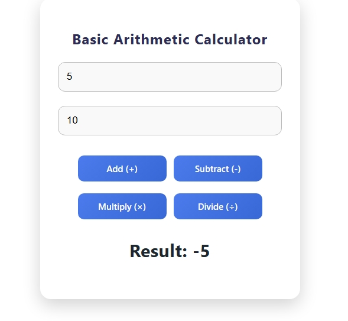

# 🧮 Basic React Calculator

A simple and clean **React-based arithmetic calculator** that performs basic operations like addition, subtraction, multiplication, and division. Includes enhanced UI with modern CSS, smooth alignment, gradient buttons, and soft shadows.

---

## 📌 Features

* Add, Subtract, Multiply, Divide
* Prevents division by zero
* Clean and modern UI design
* Gradient buttons with hover effects
* Smooth box-shadow and animations
* Fully responsive layout

---

## 📁 Project Structure

```
/my-app
|----screenshot
         |--my-app/screenshot/Screenshot_5-12-2025_14275_localhost.jpeg 
         |--my-app/screenshot/Screenshot_5-12-2025_142630_localhost.jpeg 
         |--my-app/screenshot/Screenshot_5-12-2025_142647_localhost.jpeg
         |-- my-app/screenshot/Screenshot_5-12-2025_142656_localhost.jpeg 
         |--my-app/screenshot/Screenshot_5-12-2025_142713_localhost.jpeg

|src/
│── Calculator.jsx
│── calculator.css
│── App.jsx
|--README.md

```

---
## screenshot
1.homepage


2.addition number


3.substraction


4.multiply


5.divided


## 🚀 How to Use

1. Enter **number 1**
2. Enter **number 2**
3. Click any operation button
4. Result appears instantly

---

## 🧩 Component Code (Calculator.js)

Your component handles:

* State for both numbers
* Arithmetic operations with validation
* Dynamic result updates

---

## 🎨 Styling (calculator.css)

Includes:

* Center alignment
* Smooth box shadows
* Input focus effects
* Gradient modern buttons

All CSS is located in `calculator.css`.

---

## ▶️ Run the Project

```
cd my-app
npm install
npm start
```

Your app will start at:

```
http://localhost:3000
```

---

## 📚 Future Enhancements

* Dark mode toggle
* Scientific calculator features
* History of calculations
* Responsive keypad layout


